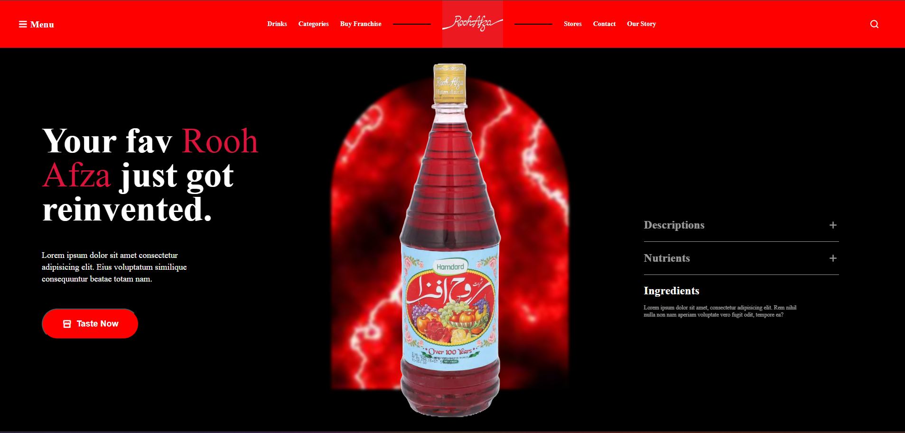
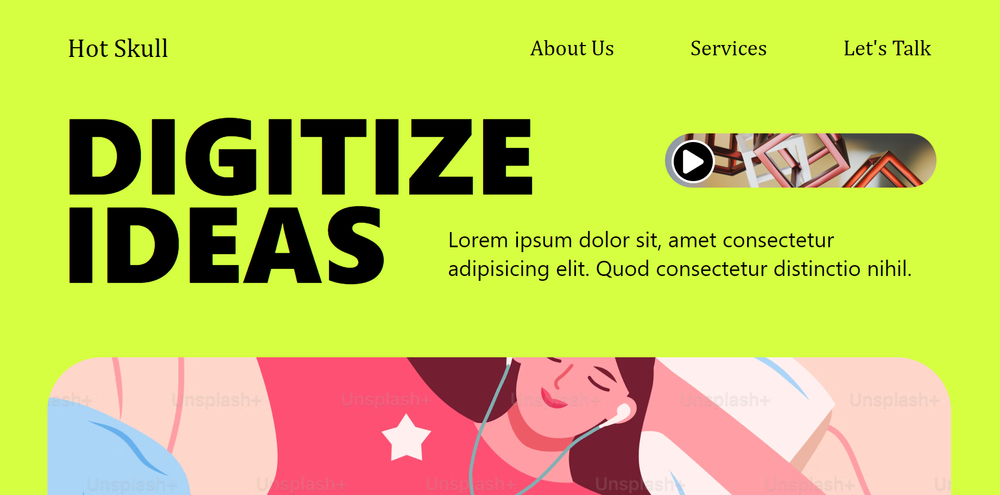

This is a collection of landing pages I created using HTML and CSS, designed to showcase different styles and layouts.

---

## Project Structure

### 1. **Responsive Landing Page: Urban Muse**
- A sleek and modern landing page designed to be fully responsive across devices.
- Features smooth navigation and adaptable layouts.
- Ideal for creative businesses and portfolios.

### 2. **Non-Responsive Landing Pages**
#### **Rooh Afza**
- A perfect landing page for beverage-related projects.

#### **Landing Page**
- A minimalist and clean design suitable for showcasing basic content.
- Focuses on simplicity and visual appeal.

---

## Screenshots

### Urban Muse
https://urban-muse.netlify.app/

### Rooh Afza
 

### Non-Responsive Landing Page

